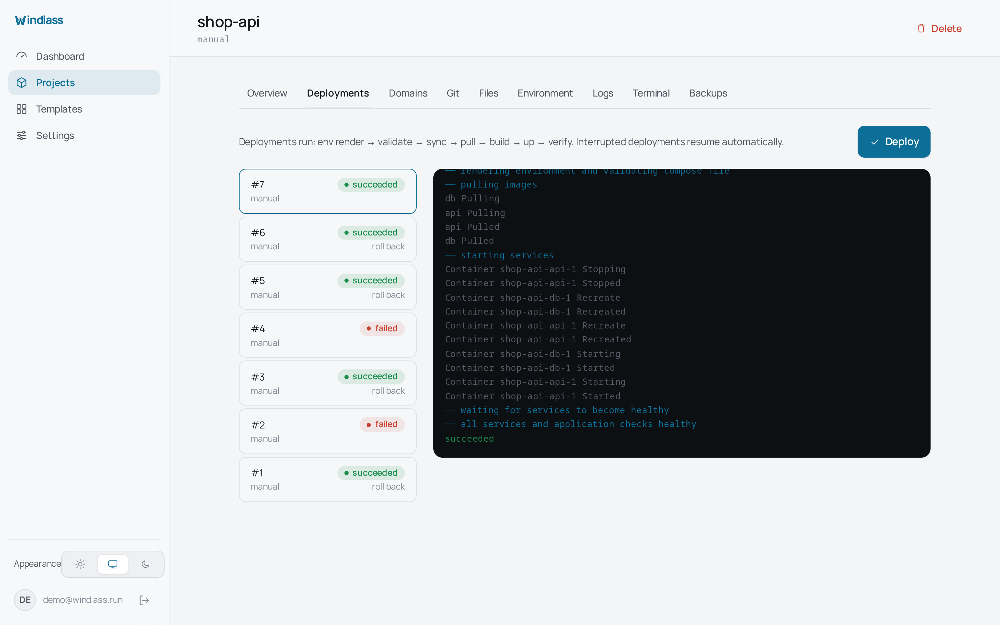

# Deployments

A deployment is a resumable state machine, not a single `docker compose up`. It runs a
fixed sequence and records every step:

```text
env render -> validate -> sync -> pull -> build -> up -> verify
```

The log streams to the Deployments tab as it goes, and is kept afterwards, so a
deployment that failed last Tuesday still has its output.



## The steps

**env render** writes `.env` from stored values. **validate** runs `docker compose config`
and refuses to continue if the file is invalid, so a typo fails before anything is
stopped. **sync** fetches the Git revision when the project is Git-backed. **pull** and
**build** fetch or build images. **up** hands over to `docker compose up -d`.

**verify** is the step that separates a deployment from a command. Windlass waits for
Docker healthchecks and any `windlass.health.*` labels to pass before reporting success. A
stack that starts and immediately crash-loops is a failed deployment, not a green one, and
the failure is recorded with its reason.

## Interruptions

If the panel restarts mid-deployment, the deployment resumes on startup. Jobs are reclaimed
by their `running` status rather than being abandoned, so a server reboot at the wrong
moment does not leave a project half-updated with nobody watching.

## Rollback

Every deployment is numbered and can be rolled back from the Deployments list. Rollback
redeploys the previous known-good revision through the same state machine, verification
included, so a rollback that would not come up healthy fails visibly rather than quietly
leaving you worse off.

## Git deployments

Connect a repository in the project's Git tab, either by pasting a clone URL or through a
GitHub connection. Windlass stores the repository, branch and auto-deploy preference in
`.windlass.json`, in the project directory, next to the compose file.

With auto-deploy on, a push triggers a deployment. The webhook is registered on the
repository for you when the connection allows it, and its secret is shown once at creation.
Windlass verifies the signature on every delivery, so an unsigned or wrongly signed
request deploys nothing.

Manual is the default. A project only auto-deploys because you asked it to.

## Private registries

Images from private registries need credentials, configured under Settings. A GitHub
connection can mint a `ghcr.io` credential directly, which saves generating a token by
hand for the common case.

## What a deployment does not do

It does not reconstruct your container specification. Windlass shells out to `docker
compose`, so what runs is what your compose file says, interpreted by Compose itself.
The panel is not a translation layer that can disagree with it.
