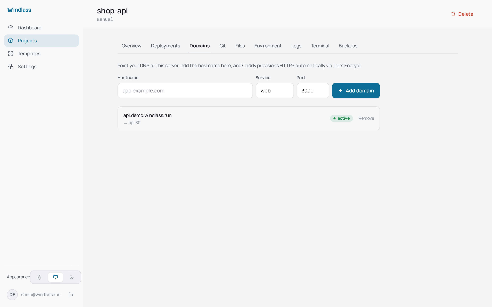

# Domains and HTTPS

Windlass drives Caddy. Add a hostname to a project, point DNS at the server, and a
certificate arrives on the first request. There is no certificate paperwork and no renewal
to remember.

## Adding a domain

In the project's Domains tab, enter the hostname and choose the service and container port
to route to. The route is live as soon as it is written; the certificate follows within a
few seconds of the first request to that hostname.

DNS must already point at the server. Let's Encrypt validates by connecting to the name,
so a hostname that does not resolve, or resolves elsewhere, cannot be issued a
certificate. This is the usual reason a new domain sits unhealthy: check the A record
before suspecting the panel.

## What Windlass touches, and what it does not

This matters if Caddy also serves things you configured yourself.

Windlass owns exactly three kinds of object in the Caddy configuration:
`windlass_routes`, `windlass_panel_route`, and the `windlass_route_*` children of the
first. It changes them with targeted operations addressed by `@id`.

It never loads or replaces the whole Caddy configuration. Routes you wrote by hand are not
read, not rewritten and not reordered by anything Windlass does. The integration suite
includes a user-owned route and asserts it survives.

## The panel's own hostname

The panel starts on port 8080. Under Settings you can give it a hostname, and Windlass
adds `windlass_panel_route` so the panel is served over HTTPS on that name.

Do this before exposing the panel to the internet. A control plane on plain HTTP over the
public network is worth avoiding even behind a password.

When Caddy is not on the host network, `WINDLASS_PANEL_UPSTREAM` sets the dial target
Caddy should use to reach the panel. See the [configuration reference](./configuration.md).

## If Windlass stops

Caddy keeps serving every route it already has, including yours. Certificates continue to
renew, because Caddy renews them, not Windlass. What stops is the ability to add or change
routes from the panel until it is running again.
