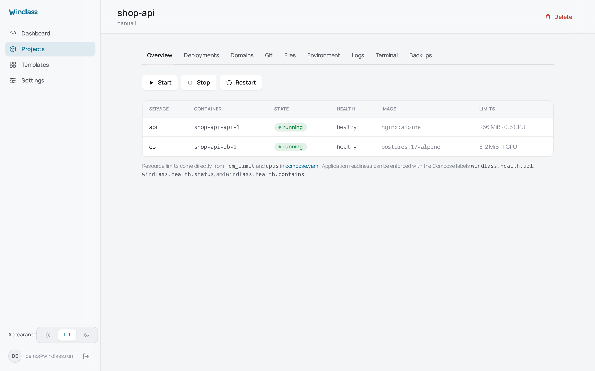
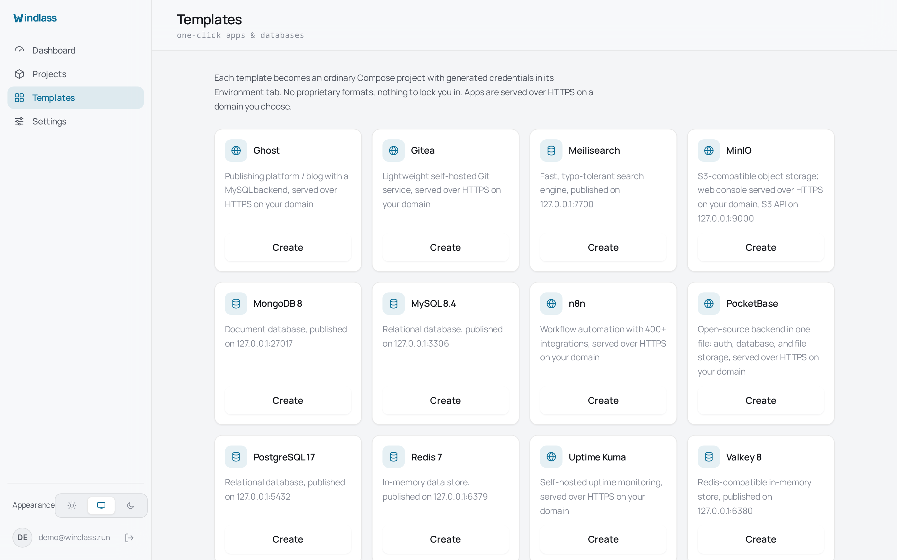

# Projects and Compose

A project is a directory. That is the whole idea, and most of what is surprising about
Windlass follows from it.

```text
<projects>/<name>/
├── compose.yaml       # services, images, ports, volumes, networks, limits
├── .env               # optional dotenv file, mode 0600
└── .windlass.json     # source repository, branch, auto-deploy, domains
```

The default projects directory is `/var/lib/windlass/projects`, which you can move with
`WINDLASS_PROJECTS`. See the [configuration reference](./configuration.md).



## The filesystem wins

Windlass runs the real `docker compose` CLI in that directory. It does not parse your
compose file into an internal model and regenerate it, so nothing is lost in translation:
no unsupported key silently dropped, no reformatting of a file you carefully commented.

Which means editing over SSH is a supported workflow, not a workaround:

```sh
cd /var/lib/windlass/projects/shop-api
vim compose.yaml
docker compose up -d
```

The panel's Files and Environment screens read the same bytes. If you change a file on
disk, the panel shows your change; if you change it in the panel, the file on disk
changes. There is no sync step and no conflict resolution, because there is only one copy.

SQLite holds platform state (users, sessions, audit entries, deployment history) and a
rebuildable index of projects and domains. It is not a second copy of your configuration.
Delete the database and your containers keep running; **Scan stacks directory** rebuilds
the index from the filesystem.

## Adopting stacks you already have

If the server already runs Compose projects, move or symlink their directories under the
projects directory and use **Scan stacks directory**. Windlass indexes what it finds,
including containers already running, without redeploying anything.

This is also the recovery path after restoring a machine from a backup: put the
directories back, scan, and the panel knows about them again.

## The environment file

`.env` is a standard dotenv file, one `KEY=value` per line, written mode 0600. Compose
substitutes it into `compose.yaml` the way it always does.

The Environment tab edits the whole file at once rather than key by key. Pasting a block
replaces the file wholesale, including removing keys that are not in what you pasted,
which is the behaviour that matches what you see on screen.

Values are visible to anyone who can read the file on the server and to anyone with panel
access at member level or above. Treat it as what it is: a secrets file on a host.

## Resource limits

Limits come from the Compose keys, not from a panel setting:

```yaml
services:
  api:
    image: nginx:alpine
    mem_limit: 256m
    cpus: 0.5
```

The project overview shows what each service is actually limited to. Note that
`deploy.resources.limits` is a Swarm key: Compose ignores it outside Swarm, so a service
configured that way runs unlimited, and the overview will correctly say so.

## Application health

Docker healthchecks are honoured. Beyond those, three labels let a deployment wait for
your application rather than for the container process:

```yaml
services:
  api:
    labels:
      windlass.health.url: http://127.0.0.1:8081/
      windlass.health.status: "200"
      windlass.health.contains: "ok"
```

A deployment is only reported succeeded once these pass. See
[Deployments](./deployments.md) for how that fits into the sequence.

## Templates



Templates create ordinary projects. A template writes a normal `compose.yaml` and a normal
`.env` with generated credentials, then gets out of the way. The generated file even says
so at the top:

```text
# This is a plain compose project. Edit it like any other.
```

There is no template runtime, no upgrade channel, and nothing that breaks if you rewrite
the file the day after creating it.
