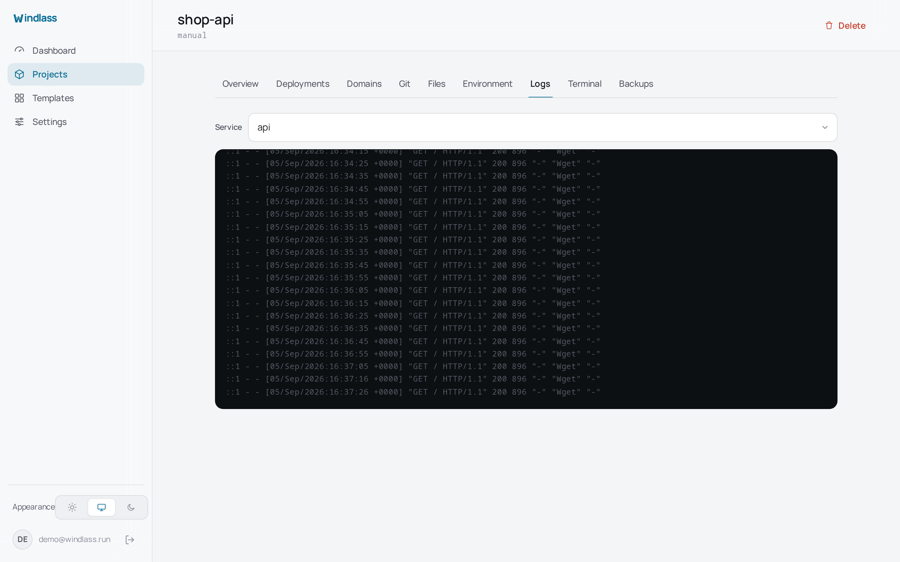

# Troubleshooting

Where to look first, and the failures that are most often misread.

## Reading the logs



```sh
sudo journalctl -u windlass -f
sudo journalctl -u windlass -n 200 --no-pager
```

For a deployment, the panel's own log is more useful than the service log: every step is
recorded and kept, including for deployments that failed.

## A deployment fails at validate

`docker compose config` rejected the file. The message is Compose's own, and it is usually
literal about the line. Nothing was stopped, because validation runs before anything is
changed.

Reproduce it directly on the server for the full context:

```sh
cd /var/lib/windlass/projects/<name>
docker compose config
```

## A deployment fails at verify

The containers started but did not become healthy. The application is the suspect, not the
panel. Check what the container is saying:

```sh
docker compose logs --tail=100
```

A crash-loop, a database that was not ready, or a `windlass.health.url` pointing somewhere
the container cannot reach are the common three. From inside a container, `127.0.0.1` is
that container, not the host: use the host's Docker bridge address (commonly
`172.17.0.1`) for a health URL that leaves the container.

## A domain has no certificate

Nearly always DNS. Let's Encrypt validates by connecting to the hostname, so it must
resolve to this server before a certificate can be issued.

```sh
dig +short your-domain.example
curl -I http://your-domain.example
```

If the record is right and recent, give it a few minutes. Behind a proxy such as
Cloudflare, an orange-clouded record means the challenge reaches the proxy rather than
your server, which is its own configuration question.

## The panel is unreachable but the sites are fine

This is expected. The panel is one process. Your containers are ordinary Compose containers with a restart policy, and Caddy
serves the routes it already has.

```sh
sudo systemctl status windlass
sudo systemctl restart windlass
```

## Docker is not reachable

The service talks to Docker through a restricted socket proxy on loopback, not through the
Docker group. If the panel reports Docker unavailable, check the proxy first:

```sh
sudo systemctl status windlass-docker-proxy
docker -H tcp://127.0.0.1:2375 version
```

The fix is to get the proxy healthy. Adding the `windlass` user to the `docker` group
would appear to work and would hand full daemon access to the panel process, which is the
boundary the proxy exists to keep.

## The panel does not know about a project that exists

Use **Scan stacks directory**. The SQLite index is rebuildable on purpose: it is derived
from the filesystem, and the filesystem is authoritative.

## Restoring after losing the database

Containers keep running throughout. Put the project directories back under the projects
directory, start Windlass, and scan. Accounts, audit and deployment history come from a
platform backup, not from the project directories. See
[Backups and restore](./backups-and-restore.md).

## Reporting a bug

Server OS and version, Docker and Compose versions (shown at the top of the dashboard),
what you did, what happened, and the relevant log lines. The compose file, with secrets
removed, usually answers the first three follow-up questions:
[github.com/Sulaiman-Dauda/windlass/issues](https://github.com/Sulaiman-Dauda/windlass/issues).
