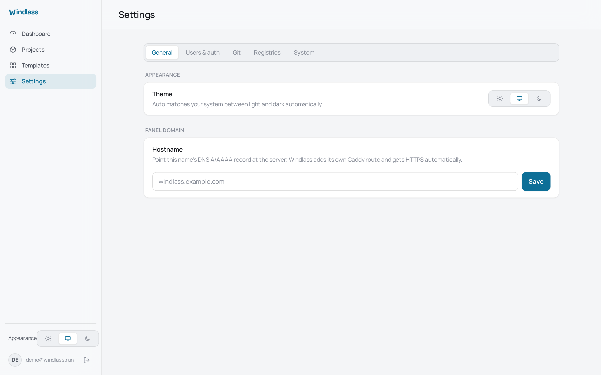

# Users and access

## Claiming an instance

The first visit to a new install creates the first account. After that the setup route
stops responding, so an instance cannot be claimed a second time by whoever reaches it
next.

Claim a new install immediately. Until the first account exists, anyone who reaches the
panel can create it.

## Roles

Three roles, in increasing order:

| Role | Can |
| --- | --- |
| `viewer` | Read projects, deployments, logs and metrics |
| `member` | Everything a viewer can, plus deploy, edit files and environment, manage domains and backups |
| `admin` | Everything a member can, plus manage users, settings, credentials and updates |

Every state-changing request is checked against the role on the server and written to the
audit log. The check is in the handler, not in whether the button was drawn, so a hidden
control is not a permission and cannot be worked around by sending the request directly.

Deleting a project requires re-entering your password, unless the account signs in only
through OAuth.

## Two-factor authentication

TOTP is available to every account and set up from Settings: scan the QR code, confirm a
code, done. It is standard RFC 6238, so any authenticator works.

Turn it on for administrators on any panel reachable from the internet. It is not
mandatory, because a single-operator install on a private network gains little from it.

## Signing in with GitHub

OAuth can be enabled for sign-in. It signs in **existing** users matched by verified
email, and does not create accounts. Someone with a GitHub account and an email you have
never added cannot get in by being first to the login page.

Create the account in the panel first, then let that person sign in with OAuth.

## Sessions

Sessions are server-side rows with an opaque cookie, not self-contained tokens, so signing
someone out actually ends their session rather than waiting for a token to expire.

## Exposing the panel

Give the panel a hostname under Settings so it is served over HTTPS rather than on
`:8080`. See [Domains and HTTPS](./domains-and-https.md).

Windlass reaches Docker through a restricted socket proxy on loopback, and its service
user is deliberately not in the `docker` group. Membership of that group is equivalent to
root, so the proxy is what keeps a compromise of the panel from becoming a compromise of
the host. Adding the user to the group removes that separation.
